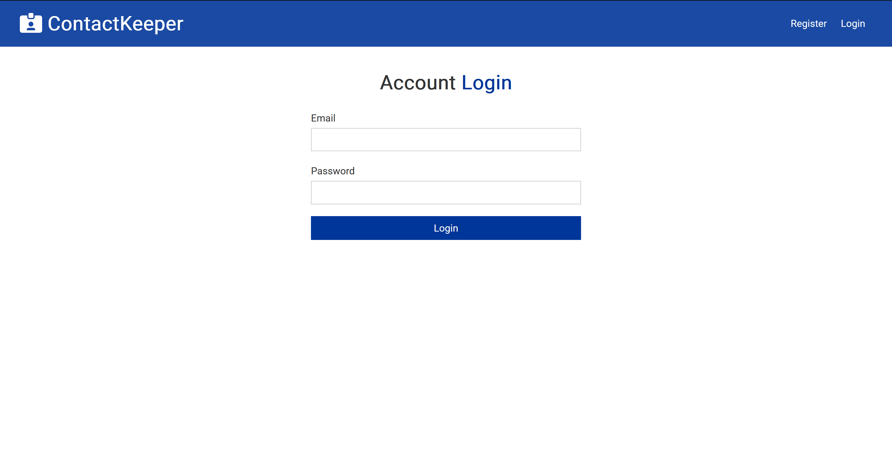

# ContactKeeper

## Description

### This project is a full-stack MERN application featuring a login and register functionality using JWT (JSON Web Tokens) for authentication. Additionally, it includes a main page where users can perform CRUD operations on contacts. All data is stored in a MongoDB database.

## Features
- **Authentication**: Users can register and login securely using JWT authentication.
- **Registration**: New users can create an account by providing necessary information.

- **Login**: Existing users can log in securely using their credentials.

- **Contact Management**: CRUD operations are available for managing contacts.
  - **Create**: Users can add new contacts.
  - **Read**: Users can view existing contacts.
  - **Update**: Users can edit contact information.
  - **Delete**: Users can remove contacts from the database.

- **MongoDB Integration**: Data is stored and managed using MongoDB.

